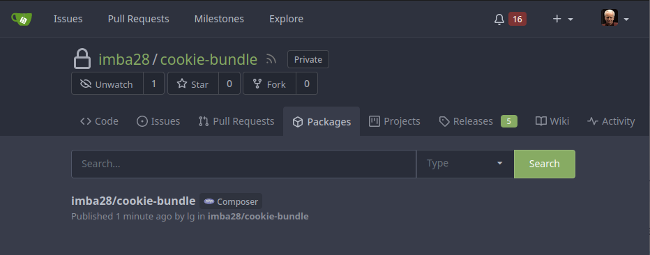

# drone-gitea-composer-release

Drone plugin to release composer packages using Gitea's package registry.
Requires Gitea >= 1.17



## Build

Build the plugin:

```shell
make gitea-composer-release
```

Build the image:
```shell
docker build -t imba28/drone-gitea-composer-release .
```

## Testing

```
make test
```

## Usage

By default, the directories `vendor` and `node_modules` and all dot files are excluded from the package.
In case you want to ignore additional files, pass them as env variables (`PLUGIN_IGNORE_PATTERNS`).

```shell
docker run --rm \
  -e DRONE_REPO_OWNER=gitea \
  -e DRONE_TAG=1.0.0 \
  -e DRONE_REPO_LINK=https://try.gitea.io/ \
  -e PLUGIN_GITEA_USER=username \
  -e PLUGIN_GITEA_TOKEN=token \
  -e PLUGIN_IGNORE_PATTERNS=\\.env,composer\\.phar \
  -w /drone/src \
  -v $(pwd):/drone/src \
  imba28/drone-gitea-composer-release
```

### Plugin step usage

If the repository is public, you have to either explicitly set credentials or configure Drone to always authenticate with the Gitea instance.
In case of a private repository the credentials are read from the .netrc created by the drone agent.

##### Example pipeline

```yaml
steps:
  - name: install packages
    image: php:8.0
    commands:
      - apt-get update && apt-get install -yf git zip unzip
      - php -r "copy('https://getcomposer.org/installer', 'composer-setup.php');"
      - php composer-setup.php --filename=composer.phar --version=2.1.6 && rm composer-setup.php
      - ./composer.phar install --ignore-platform-reqs
      - vendor/bin/simple-phpunit --check-version
    
  - name: test
    image: php:8.0
    commands:
      - vendor/bin/simple-phpunit --testdox
    depends_on:
      - install packages
  
  - name: publish composer package
    image: imba28/drone-gitea-composer-release
    settings:
      # version: 1.0.0 # optional, retrieved from composer.json or git tag
      # gitea_url: https://my.gitea.example.com/ # optional, retrieved from drone env vars
      # owner: imba28 # optional, retrieved from drone env vars
      gitea_user:
        from_secret: gitea_user
      gitea_token:
        from_secret: gitea_token
      ignore_patterns:
        - composer\\.phar
    when:
      event:
        - tag
```
